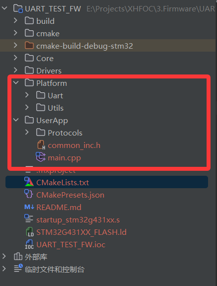
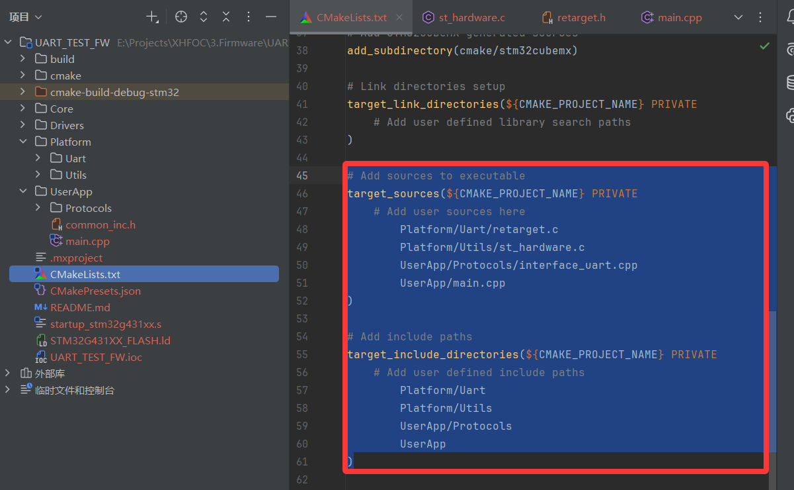
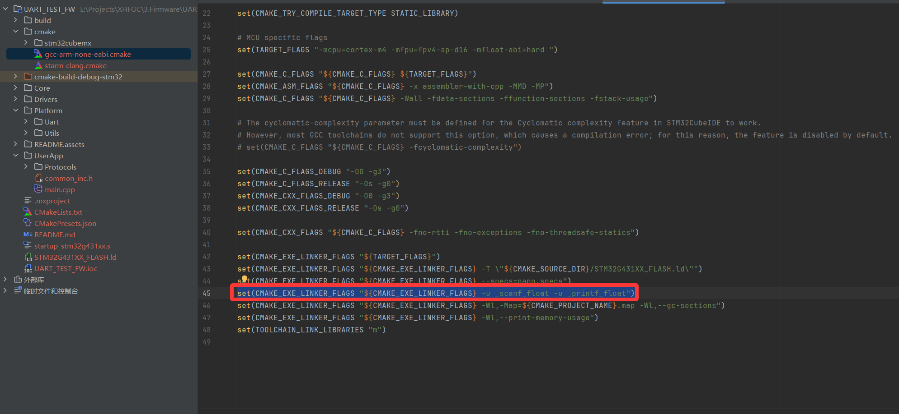
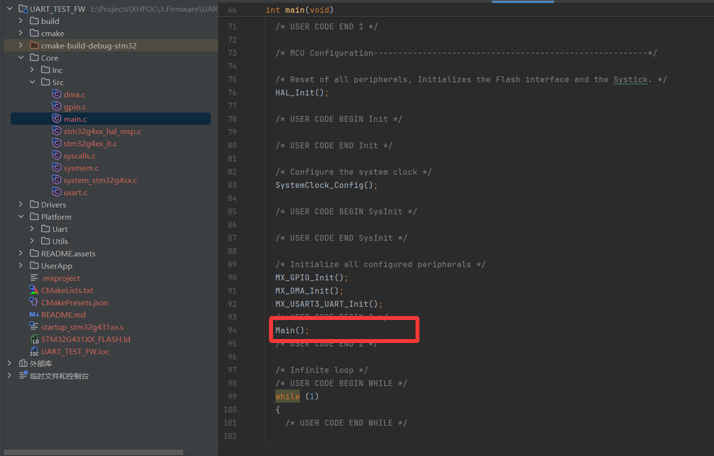
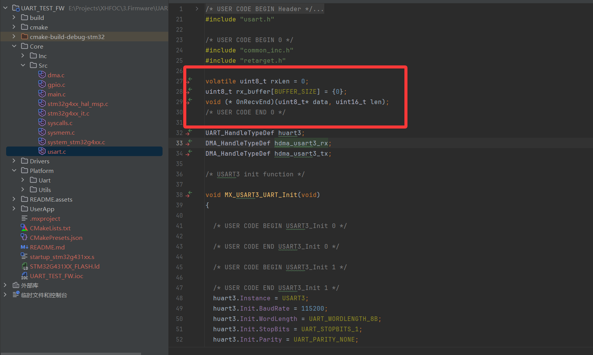
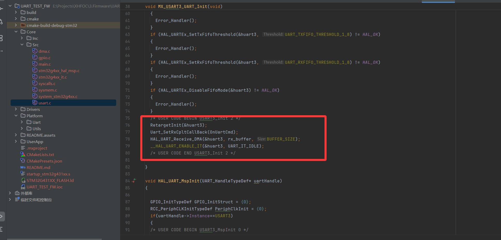
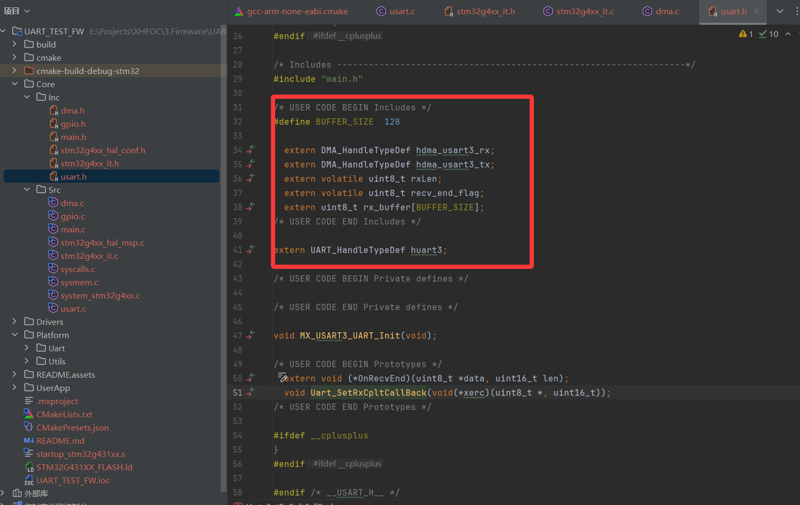
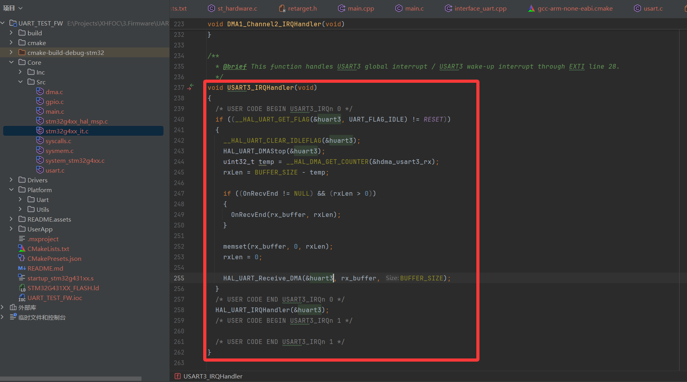

# UART_DEMO

## UART_DMA移植流程

- 配置开启UART的DMA传输，RX和TX均为normal，开启串口、DMA中断，设置中断优先级为3

- 将文件加入项目

  

- CMakeLists.txt修改

  ```
  # Add sources to executable
  target_sources(${CMAKE_PROJECT_NAME} PRIVATE
      # Add user sources here
          Platform/Uart/retarget.c
          Platform/Utils/st_hardware.c
          UserApp/Protocols/interface_uart.cpp
          UserApp/main.cpp
  )
  
  # Add include paths
  target_include_directories(${CMAKE_PROJECT_NAME} PRIVATE
      # Add user defined include paths
          Platform/Uart
          Platform/Utils
          UserApp/Protocols
          UserApp
  )
  ```

  

- gcc-arm-none-eabi.cmake文件修改，使其支持浮点数

  ```
  set(CMAKE_EXE_LINKER_FLAGS "${CMAKE_EXE_LINKER_FLAGS} -u _scanf_float -u _printf_float")
  ```

  

- main.c修改

  

- usart.c修改

  

  

- usart.h修改

  

- stm32g4xx_it.c修改

  

- 
